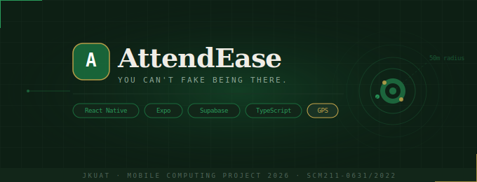

<div align="center">
  
</div>

<br/>

[](https://expo.dev)
[](https://reactnative.dev)
[](https://supabase.com)
[](https://typescriptlang.org)
[](https://expo.dev/eas)

<br/>

> **AttendEase** is a GPS-verified, biometric-secured attendance system built for JKUAT.  
> No proxies. No paper. No excuses.

<br/>

---

</div>

## 📡 &nbsp;What Is This?

Imagine a lecturer walks into a room, opens an app, taps one button — and attendance is **open**. The app captures their GPS position and draws an invisible fence around the room. Every student who walks in, pulls out their phone, and marks present gets verified by the server in real time. If they're outside the fence? Rejected. Different device? Rejected. Already checked in? Rejected.

That's AttendEase. Built for **JKUAT**, designed for scale.

<br/>

---

## ⚡ &nbsp;Feature Breakdown

<table>
<tr>
<td width="50%">

### 🔐 &nbsp;Authentication
- Email + Password sign-in
- **Biometric verification** (fingerprint / face ID)
- Role-based routing — Student, Lecturer, Admin land on their own dashboards automatically
- Persistent sessions via SecureStore (mobile) and localStorage (web)
- Device fingerprinting — your account is locked to your phone

</td>
<td width="50%">

### 📍 &nbsp;GPS Geofencing
- Lecturer's live position becomes the **geofence center**
- Configurable radius: 30m / 50m / 75m / 100m
- Haversine formula for accurate spherical distance
- ±10m GPS drift buffer (real-world tolerance)
- Server-side re-verification via Supabase Edge Function

</td>
</tr>
<tr>
<td width="50%">

### 🎯 &nbsp;Session Management
- Instant session creation with room label
- Live attendance counter updates in real time
- Supabase Realtime subscriptions — roster updates the second a student checks in
- Session timer running since `started_at`
- One-tap end session → attendance closes, report generated

</td>
<td width="50%">

### 📊 &nbsp;Reports & Analytics
- Per-session attendance breakdown
- CSV export (share directly from phone)
- Analytics: bar chart per session, trend line, quality distribution
- Admin panel: full platform overview, all users, all sessions
- Historical logs for every student

</td>
</tr>
</table>

<br/>

---

## 🏗 &nbsp;Architecture

```
┌─────────────────────────────────────────────────────────────┐
│                        CLIENT LAYER                          │
│                                                              │
│   React Native (Expo)  ─────────────────────────────────    │
│   ├── expo-router      (file-based navigation)              │
│   ├── expo-location    (GPS on native)                      │
│   ├── expo-local-auth  (biometric)                          │
│   ├── expo-secure-store(credential storage)                 │
│   └── navigator.geo    (GPS on web)                         │
└───────────────────────┬─────────────────────────────────────┘
                        │ HTTPS / WebSocket
┌───────────────────────▼─────────────────────────────────────┐
│                      SUPABASE LAYER                          │
│                                                              │
│   ├── Auth             (JWT sessions, role metadata)        │
│   ├── PostgreSQL        (profiles, units, sessions, logs)   │
│   ├── Row Level Security(per-user data isolation)           │
│   ├── Realtime          (live attendance subscriptions)     │
│   └── Edge Functions    (server-side GPS verification)      │
└─────────────────────────────────────────────────────────────┘
```

<br/>

---

## 📂 &nbsp;Project Structure

```
AttendEase/
│
├── app/                          # Expo Router — every file is a route
│   ├── _layout.tsx               # Root: auth guard + role-based routing
│   ├── index.tsx                 # Entry spinner
│   │
│   ├── (auth)/
│   │   ├── login.tsx             # Role selector + credentials
│   │   └── biometric.tsx         # Fingerprint verification + fallback
│   │
│   ├── (student)/
│   │   ├── home.tsx              # GPS check-in interface
│   │   └── history.tsx           # Personal attendance history
│   │
│   ├── (lecturer)/
│   │   ├── dashboard.tsx         # Session control + live roster
│   │   └── reports.tsx           # Analytics + CSV export
│   │
│   └── (admin)/
│       ├── dashboard.tsx         # Platform overview + user management
│       └── calibrate.tsx         # GPS calibration tool
│
├── components/
│   ├── AttendanceButton.tsx      # Animated check-in button (5 states)
│   ├── GPSStatusBadge.tsx        # Live GPS signal indicator
│   ├── ReportCard.tsx            # Session report card
│   └── AnalyticsCharts.tsx       # Bar chart + trend line + quality ring
│
├── hooks/
│   ├── useAuth.ts                # Auth state + biometric + signOut
│   └── useLocation.ts            # GPS + geofence hook
│
├── lib/
│   ├── supabase.ts               # Client + platform-aware storage adapter
│   └── geofence.ts               # Haversine distance + geofence logic
│
├── supabase/
│   └── functions/
│       └── verify-attendance/
│           └── index.ts          # Edge function: server-side GPS check
│
└── types/
    └── index.ts                  # Shared TypeScript definitions
```

<br/>

---

## 🗄 &nbsp;Database Schema

```sql
universities ──┬── buildings ── classrooms
               │
               ├── profiles (students / lecturers / admins)
               │       │
               │       ├── units (lecturer_id → profiles)
               │       │       │
               │       │       └── sessions (unit_id → units)
               │       │               │
               │       └───────────────└── attendance_logs
               │                           (student_id + session_id)
               └── attendance_logs (university_id)
```

### Key Design Decisions

| Decision | Reason |
|----------|--------|
| `center_lat/lng` on `sessions` | Lecturer's live GPS = geofence center. No pre-configured rooms needed. |
| `room_label` (free text) | Venues change. Flexibility beats rigidity. |
| `device_id` on `attendance_logs` | Anti-proxy: one device per student account |
| `unique(session_id, student_id)` | Database-enforced no double check-ins |
| Edge function verification | Client GPS can be spoofed. Server re-checks. |

<br/>

---

## 🔐 &nbsp;Security Model

```
THREAT: Student asks friend to check in for them
DEFENCE: Device fingerprinting — account locked to registered device

THREAT: Student fakes GPS location
DEFENCE: Server-side re-verification in Edge Function

THREAT: Double check-in
DEFENCE: Unique constraint on (session_id, student_id)

THREAT: Unauthorized data access
DEFENCE: Row Level Security — every query filtered by auth.uid()

THREAT: Stolen credentials
DEFENCE: Biometric second factor — must physically hold registered device
```

<br/>

---

## 🚀 &nbsp;Quick Start

### 1. Clone & Install

```bash
git clone https://github.com/chaz-ux/AttendEase.git
cd AttendEase
npm install
```

### 2. Environment

```bash
# Create .env in project root
EXPO_PUBLIC_SUPABASE_URL=https://your-project.supabase.co
EXPO_PUBLIC_SUPABASE_ANON_KEY=your-anon-key
```

### 3. Run

```bash
npx expo start --clear

# Then:
# Press A → Android emulator
# Press W → Browser
# Scan QR → Expo Go on physical device
```

### 4. Deploy Edge Function

```bash
npx supabase login
npx supabase link --project-ref YOUR_PROJECT_REF
npx supabase functions deploy verify-attendance
```

### 5. Build APK

```bash
npx eas build --platform android --profile preview
```

<br/>

---

## 👤 &nbsp;Test Accounts

> Use these to evaluate the system. All accounts are pre-seeded on the JKUAT Supabase instance.

| Role | Login ID | Password | Name |
|------|----------|----------|------|
| 🎓 Student | `SCM211-0631/2022` | `Test1234!` | Kariuki Charles Chege |
| 🎓 Student | `SCM211-0632/2022` | `Test1234!` | Achieng Grace |
| 🎓 Student | `SCM211-0633/2022` | `Test1234!` | Mutua Brian Kioko |
| 👨‍🏫 Lecturer | `lecturer001` | `Test1234!` | Dr. Mwangi Joseph |
| 👩‍🏫 Lecturer | `lecturer002` | `Test1234!` | Dr. Wanjiku Njeri |
| 🔧 Admin | `admin` | `Test1234!` | System Administrator |

> **Login format:** Students enter reg number (e.g. `SCM211-0631/2022`), staff enter ID (e.g. `lecturer001`). The app auto-constructs the `@jkuat.ac.ke` email.

<br/>

---

## 🎬 &nbsp;Evaluation Walkthrough

### Demo Flow (5 minutes)

```
1. LECTURER LOGIN
   → Login as lecturer001
   → Dashboard shows units: STA 2401, STA 2301, MAT 2101
   → Select STA 2401
   → Type room: "NCLB 3"
   → Set radius: 50m
   → Tap START SESSION NOW
   → Session goes LIVE ✓

2. STUDENT CHECK-IN (separate device / browser tab)
   → Login as SCM211-0631/2022
   → Active session appears instantly
   → Tap MARK PRESENT
   → GPS verified → CHECKED IN ✓
   → Lecturer's roster updates in real time

3. REPORTS
   → Lecturer taps REPORTS in nav
   → See bar chart, trend line, quality breakdown
   → Tap EXPORT CSV → share sheet opens

4. ADMIN
   → Login as admin
   → Overview: student count, lecturer count, sessions, check-ins
   → Users tab: all registered users
   → Sessions tab: all sessions with attendance rates
```

> **For GPS demo:** The geofence radius can be temporarily increased to 5000m so evaluation works from any location. Contact the developer to adjust before the demo.

<br/>

---

## 📱 &nbsp;Screens

| Screen | Role | Description |
|--------|------|-------------|
| Login | All | Role selector + credentials |
| Biometric | All | Fingerprint verification |
| Student Home | Student | GPS check-in + active session card |
| Student History | Student | Personal attendance logs + stats |
| Lecturer Dashboard | Lecturer | Session control + live roster |
| Lecturer Reports | Lecturer | Analytics + CSV export |
| Admin Dashboard | Admin | Platform overview + user management |
| GPS Calibrate | Admin | Classroom coordinate calibration |

<br/>

---

## 🛠 &nbsp;Tech Stack

| Category | Technology | Version |
|----------|-----------|---------|
| Framework | React Native | 0.76.9 |
| Platform | Expo | 52.0.0 |
| Navigation | expo-router | 4.0.22 |
| Backend | Supabase | latest |
| Database | PostgreSQL | 15 |
| Auth | Supabase Auth + expo-local-authentication | — |
| GPS | expo-location + navigator.geolocation | — |
| Storage | expo-secure-store + localStorage | — |
| Build | EAS (Expo Application Services) | — |
| Language | TypeScript | 5.3 |
| Serverless | Supabase Edge Functions (Deno) | — |

<br/>

---

## 🔮 &nbsp;Roadmap

- [ ] QR code check-in as GPS alternative
- [ ] Push notifications (session started alerts)
- [ ] Offline mode with sync on reconnect
- [ ] Selfie verification (extra anti-proxy layer)
- [ ] Admin bulk user import via CSV
- [ ] Multi-university support
- [ ] Date-range report filtering
- [ ] Google Play / App Store deployment

<br/>

---

<div align="center">

---

Built at **JKUAT** · Mobile Computing Project 2026

**Kariuki Charles Chege** — `SCM211-0631/2022`

[github.com/chaz-ux/AttendEase](https://github.com/chaz-ux/AttendEase)

---

*"The best attendance system is one students can't cheat and lecturers don't have to think about."*

</div>